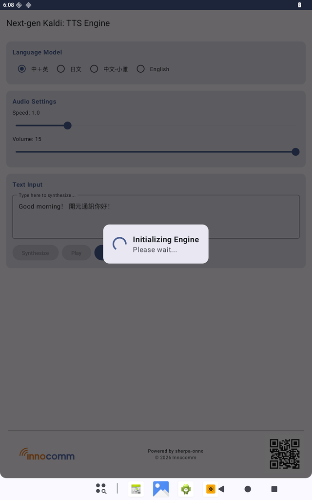
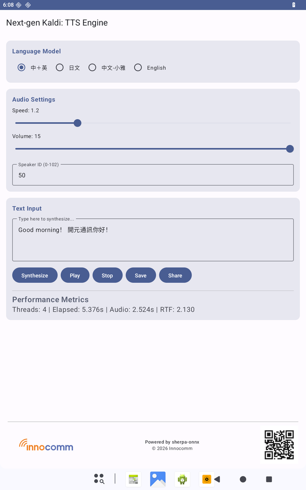
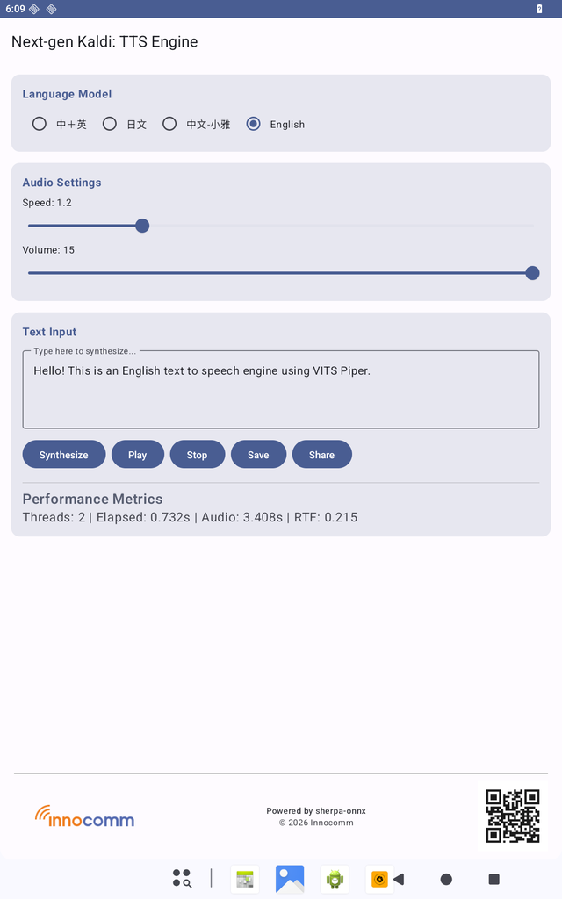

# Sherpa ONNX TTS Engine

This is an offline, multi-language Text-To-Speech (TTS) engine for Android, powered by [sherpa-onnx](https://github.com/k2-fsa/sherpa-onnx) and Next-generation Kaldi. 

It implements Android's native `TextToSpeechService`, allowing it to be used as a system-wide TTS engine. This means you can use it to power screen readers (like TalkBack), navigation apps, e-book readers, and any other application that relies on the Android TTS API.

## Features

*   **Fully Offline**: Runs completely on-device without any internet connection required.
*   **System-Wide TTS**: Acts as a native Android TTS engine.
*   **Instant Model Switching**: Simultaneously loads multiple TTS models in memory for instantaneous switching between languages.
*   **Supported Languages & Models**:
    *   **Chinese + English**: Powered by the `Kokoro Multi-Language v1.1` model.
    *   **Japanese**: Powered by the `Supertonic v3` (int8) model.
    *   **Chinese (Xiao Ya)**: Powered by the `VITS Piper Xiao Ya` (int8) model.
    *   **English (Lessac)**: Powered by the `VITS Piper English Lessac` (int8) model.
*   **Testing App**: Includes a frontend UI (`MainActivity`) to generate audio, adjust speech speed, test Real-Time Factor (RTF), and save generated `.wav` files.
*   **Automatic Model Downloading**: Models are automatically downloaded from GitHub Releases during the Gradle `preBuild` phase, keeping the repository size small.

## Screenshots

  
  
  
  

## Acknowledgements and Licenses

This project is built upon several open-source libraries and models. We are grateful to the authors and communities behind these incredible tools.

*   **[sherpa-onnx](https://github.com/k2-fsa/sherpa-onnx)**
    *   Copyright (c) Xiaomi Corporation, k2-fsa developers, and contributors.
    *   License: [Apache License 2.0](https://github.com/k2-fsa/sherpa-onnx/blob/master/LICENSE)
*   **[ONNX Runtime](https://github.com/microsoft/onnxruntime)**
    *   Copyright (c) Microsoft Corporation.
    *   License: [MIT License](https://github.com/microsoft/onnxruntime/blob/main/LICENSE)
*   **[eSpeak-NG](https://github.com/espeak-ng/espeak-ng)** (Used for text phonemization)
    *   Copyright (c) eSpeak-NG developers.
    *   License: [GNU General Public License v3.0](https://github.com/espeak-ng/espeak-ng/blob/master/COPYING)
*   **TTS Models (Downloaded dynamically during build)**
    *   *Note: This repository does not host the model weights. They are downloaded from the [sherpa-onnx releases](https://github.com/k2-fsa/sherpa-onnx/releases) during the build process.*
    *   **Kokoro**: Developed by the Kokoro TTS project / HuggingFace community. License: [Apache License 2.0](https://huggingface.co/hexgrad/Kokoro-82M).
    *   **Supertonic**: Developed for Japanese synthesis. Please refer to the original author's repository for license details.
    *   **Xiao Ya (VITS Piper)**: High-quality Chinese synthesis model. Piper models and code are generally distributed under the [MIT License](https://github.com/rhasspy/piper).
    *   **Lessac (VITS Piper)**: English synthesis model. Piper models and code are generally distributed under the [MIT License](https://github.com/rhasspy/piper).
    *   *Disclaimer: Users of this application must comply with the original licenses and terms of service of the respective TTS models and datasets.*

---
*This package has been modified and customized by [Innocomm](https://www.innocomm.com/).*
*Generated and maintained with 🩵 by the open-source community.*
